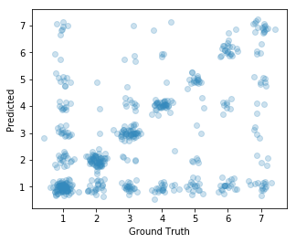

# Import


```python
%matplotlib inline

import re

import numpy as np
import pandas as pd
import matplotlib.pyplot as plt
from nltk.corpus import stopwords
from nltk.tokenize import regexp_tokenize
from sklearn import cross_validation
from sklearn.feature_extraction.text import TfidfVectorizer
from sklearn.svm import LinearSVC
from sklearn.metrics import accuracy_score
```

    /home/duyetdev/.local/lib/python2.7/site-packages/sklearn/cross_validation.py:44: DeprecationWarning: This module was deprecated in version 0.18 in favor of the model_selection module into which all the refactored classes and functions are moved. Also note that the interface of the new CV iterators are different from that of this module. This module will be removed in 0.20.
      "This module will be removed in 0.20.", DeprecationWarning)


```python
def jitter(values, sd=0.25):
    return [np.random.normal(v, sd) for v in values]
```


```python
def clean_text(df, col):
    """A function for keeping only alpha-numeric
    characters and replacing all white space with
    a single space.
    """
    return df[col].apply(lambda x: re.sub('[^A-Za-z0-9]+', ' ', x.lower()))\
                  .apply(lambda x: re.sub('\s+', ' ', x).strip())
```


```python
def count_pattern(df, col, pattern):
    """Count the occurrences of `pattern`
    in df[col].
    """
    df = df.copy()
    return df[col].str.count(pattern)
```


```python
def split_on_word(text):
    """Use regular expression tokenizer.
    Keep apostrophes.
    Returns a list of lists, one list for each sentence:
        [[word, word], [word, word, ..., word], ...].
    """
    if type(text) is list:
        return [regexp_tokenize(sentence, pattern="\w+(?:[-']\w+)*") for sentence in text]
    else:
        return regexp_tokenize(text, pattern="\w+(?:[-']\w+)*")
```


```python
def normalize(tokenized_words):
    """Removes stop words, numbers, short words, and lowercases text.
    Returns a list of lists, one list for each sentence:
        [[word, word], [word, word, ..., word], ...].
    """
    stop_words = stopwords.words('english')
    return [[w.lower() for w in sent
             if (w.lower() not in stop_words)]
            for sent in tokenized_words]
```


```python
def features(df):
    df = df.copy()
    df['n_questionmarks'] = count_pattern(df, 'Text', '\?')
    df['n_periods'] = count_pattern(df, 'Text', '\.')
    df['n_apostrophes'] = count_pattern(df, 'Text', '\'')
    df['first_word'] = df.text_clean.apply(lambda x: split_on_word(x)[0])
    question_words = ['what', 'how', 'why', 'is']
    for w in question_words:
        col_wc = 'n_' + w
        col_fw = 'fw_' + w
        df[col_wc] = count_pattern(df, 'text_clean', w)
        df[col_fw] = (df.first_word == w) * 1
        
    del df['first_word']
    
    df['n_words'] = df.Text.apply(lambda x: len(split_on_word(x)))
    return df
```


```python
def flatten_words(list1d, get_unique=False):
    qa = [s.split() for s in list1d]
    if get_unique:
        return sorted(list(set([w for sent in qa for w in sent])))
    else:
        return [w for sent in qa for w in sent]
```

# Data


```python
training = pd.read_csv('data/newtrain.csv')
training.head()
```


<div>
<style>
    .dataframe thead tr:only-child th {
        text-align: right;
    }

    .dataframe thead th {
        text-align: left;
    }

    .dataframe tbody tr th {
        vertical-align: top;
    }
</style>
<table border="1" class="dataframe">
  <thead>
    <tr style="text-align: right;">
      <th></th>
      <th>Category</th>
      <th>Text</th>
    </tr>
  </thead>
  <tbody>
    <tr>
      <th>0</th>
      <td>5</td>
      <td>why are yawns contagious? when people yawn</td>
    </tr>
    <tr>
      <th>1</th>
      <td>6</td>
      <td>what is trans fat? how to reduce that? i heard...</td>
    </tr>
    <tr>
      <th>2</th>
      <td>1</td>
      <td>roth ira vs 401k? what is the difference betwe...</td>
    </tr>
    <tr>
      <th>3</th>
      <td>1</td>
      <td>how many planes fedex has? i heard that it is ...</td>
    </tr>
    <tr>
      <th>4</th>
      <td>2</td>
      <td>what is the best photo slideshow creation appl...</td>
    </tr>
  </tbody>
</table>
</div>


```python
test = pd.read_csv('./data/newtest.csv')
test.head()
```


<div>
<style>
    .dataframe thead tr:only-child th {
        text-align: right;
    }

    .dataframe thead th {
        text-align: left;
    }

    .dataframe tbody tr th {
        vertical-align: top;
    }
</style>
<table border="1" class="dataframe">
  <thead>
    <tr style="text-align: right;">
      <th></th>
      <th>Id</th>
      <th>Text</th>
    </tr>
  </thead>
  <tbody>
    <tr>
      <th>0</th>
      <td>1</td>
      <td>ave u ever been dump before? ???</td>
    </tr>
    <tr>
      <th>1</th>
      <td>2</td>
      <td>my wife is not interested in sex</td>
    </tr>
    <tr>
      <th>2</th>
      <td>3</td>
      <td>best looking doctor on er?</td>
    </tr>
    <tr>
      <th>3</th>
      <td>4</td>
      <td>does sbc yahoo 2wire installation software sup...</td>
    </tr>
    <tr>
      <th>4</th>
      <td>5</td>
      <td>why and when was the mason-dixon line completed?</td>
    </tr>
  </tbody>
</table>
</div>


## Cleaning data

Remove non-alpha numeric characters and extra whitespace.


```python
training['text_clean'] = clean_text(training, 'Text')
test['text_clean'] = clean_text(test, 'Text')
```

## Feature Engineering

### TF-IDF


```python
all_text = training['text_clean'].values.tolist() + test['text_clean'].values.tolist()
vocab = flatten_words(all_text, get_unique=True)
tfidf = TfidfVectorizer(stop_words='english', vocabulary=vocab)
training_matrix = tfidf.fit_transform(training.text_clean)
test_matrix = tfidf.fit_transform(test.text_clean)
```


```python
training_matrix
```


    <2698x8820 sparse matrix of type '<type 'numpy.float64'>'
    	with 17423 stored elements in Compressed Sparse Row format>


### Other Features


```python
training = features(training)
training = pd.concat([training, pd.DataFrame(training_matrix.todense())], axis=1)
training.head(3)
```


<div>
<style>
    .dataframe thead tr:only-child th {
        text-align: right;
    }

    .dataframe thead th {
        text-align: left;
    }

    .dataframe tbody tr th {
        vertical-align: top;
    }
</style>
<table border="1" class="dataframe">
  <thead>
    <tr style="text-align: right;">
      <th></th>
      <th>Category</th>
      <th>Text</th>
      <th>text_clean</th>
      <th>n_questionmarks</th>
      <th>n_periods</th>
      <th>n_apostrophes</th>
      <th>n_what</th>
      <th>fw_what</th>
      <th>n_how</th>
      <th>fw_how</th>
      <th>...</th>
      <th>8810</th>
      <th>8811</th>
      <th>8812</th>
      <th>8813</th>
      <th>8814</th>
      <th>8815</th>
      <th>8816</th>
      <th>8817</th>
      <th>8818</th>
      <th>8819</th>
    </tr>
  </thead>
  <tbody>
    <tr>
      <th>0</th>
      <td>5</td>
      <td>why are yawns contagious? when people yawn</td>
      <td>why are yawns contagious when people yawn</td>
      <td>1</td>
      <td>0</td>
      <td>0</td>
      <td>0</td>
      <td>0</td>
      <td>0</td>
      <td>0</td>
      <td>...</td>
      <td>0.0</td>
      <td>0.0</td>
      <td>0.0</td>
      <td>0.0</td>
      <td>0.0</td>
      <td>0.0</td>
      <td>0.0</td>
      <td>0.0</td>
      <td>0.0</td>
      <td>0.0</td>
    </tr>
    <tr>
      <th>1</th>
      <td>6</td>
      <td>what is trans fat? how to reduce that? i heard...</td>
      <td>what is trans fat how to reduce that i heard t...</td>
      <td>4</td>
      <td>1</td>
      <td>0</td>
      <td>1</td>
      <td>1</td>
      <td>1</td>
      <td>0</td>
      <td>...</td>
      <td>0.0</td>
      <td>0.0</td>
      <td>0.0</td>
      <td>0.0</td>
      <td>0.0</td>
      <td>0.0</td>
      <td>0.0</td>
      <td>0.0</td>
      <td>0.0</td>
      <td>0.0</td>
    </tr>
    <tr>
      <th>2</th>
      <td>1</td>
      <td>roth ira vs 401k? what is the difference betwe...</td>
      <td>roth ira vs 401k what is the difference betwee...</td>
      <td>3</td>
      <td>0</td>
      <td>0</td>
      <td>1</td>
      <td>0</td>
      <td>0</td>
      <td>0</td>
      <td>...</td>
      <td>0.0</td>
      <td>0.0</td>
      <td>0.0</td>
      <td>0.0</td>
      <td>0.0</td>
      <td>0.0</td>
      <td>0.0</td>
      <td>0.0</td>
      <td>0.0</td>
      <td>0.0</td>
    </tr>
  </tbody>
</table>
<p>3 rows × 17655 columns</p>
</div>


```python
test = features(test)
test = pd.concat([test, pd.DataFrame(test_matrix.todense())], axis=1)
```

## Split the Training Data


```python
train, dev = cross_validation.train_test_split(training, test_size=0.2, random_state=1868)
```

# Training with SVM


```python
svm = LinearSVC(dual=False, max_iter=5000)
```


```python
features = train.columns[3:]
X = train[features].values
y = train['Category'].values
features_dev = dev[features].values

```

## Cross-validation


```python
kf = cross_validation.KFold(n=len(train), n_folds=5)
```


```python
print(np.array([svm.fit(X[tr], y[tr]).score(X[te], y[te]) for tr, te in kf]).mean())
```

    0.519910629887


# Test


```python
svm.fit(X, y)
```


    LinearSVC(C=1.0, class_weight=None, dual=False, fit_intercept=True,
         intercept_scaling=1, loss='squared_hinge', max_iter=5000,
         multi_class='ovr', penalty='l2', random_state=None, tol=0.0001,
         verbose=0)


```python
dev_predicted = svm.predict(features_dev)
```


```python
accuracy_score(dev.Category, dev_predicted)
```


    0.53888888888888886


```python
%matplotlib inline
plt.figure(figsize=(5, 4))

plt.scatter(jitter(dev.Category, 0.15),
            jitter(dev_predicted, 0.15),
            color='#348ABD', alpha=0.25)

plt.xlabel('Ground Truth')
plt.ylabel('Predicted')
```


    <matplotlib.text.Text at 0x7f39ef9795d0>




